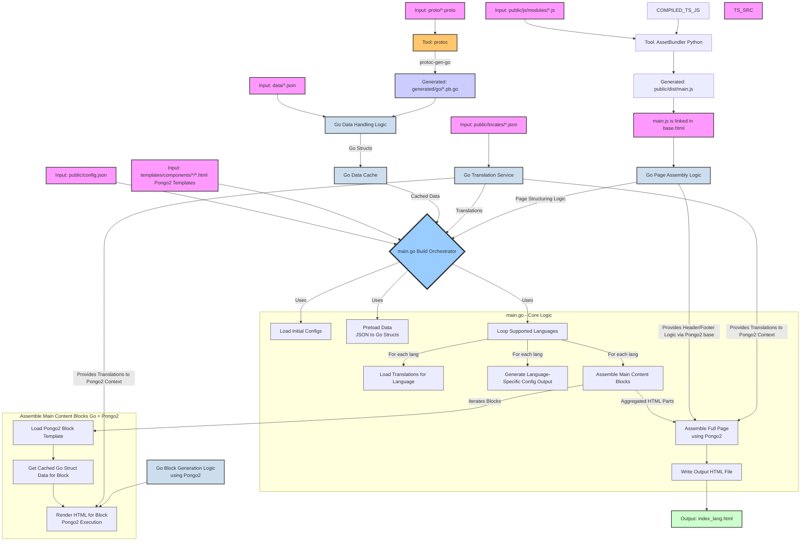

# Data Flow and Protobuf Definitions

This document outlines the structure of our data entities defined using Protocol Buffers and how they are utilized within the `build.py` script to generate dynamic HTML content.

## Protobuf Message Definitions

We use Protocol Buffers to define the schema for our dynamic data entities. Common types like `I18nString` (for internationalized strings), `Image`, `CTA` (Call To Action), and `TitledBlock` are defined in `common.proto`.

### `BlogPost` (`blog_post.proto`)

Represents a single blog post item. Loaded as a list from `data/blog_posts.json`.

```proto
message BlogPost {
  string id = 1;                // Unique identifier
  I18nString title = 2;         // Title of the blog post
  I18nString excerpt = 3;       // Short summary of the post
  CTA cta = 4;                  // Call to action (e.g., "Read More")
}
```

### `PortfolioItem` (`portfolio_item.proto`)

Represents a single portfolio item. Loaded as a list from `data/portfolio_items.json`.

```proto
message PortfolioItem {
  string id = 1;                // Unique identifier
  Image image = 2;              // Image for the portfolio item
  TitledBlock details = 3;      // Title and description for the item
}
```

### `HeroItem` (`hero_item.proto`)

Represents the content for the hero section, supporting multiple variations for A/B testing or content rotation. Loaded as a single `HeroItem` message from `data/hero_item.json`.

```proto
message HeroItemContent {
  I18nString title = 1;         // Main headline for this variation
  I18nString subtitle = 2;      // Supporting text for this variation
  CTA cta = 3;                  // Primary call to action for this variation
  string variation_id = 4;      // Unique identifier for this variation
}

message HeroItem {
  repeated HeroItemContent variations = 1; // A list of content variations for the hero section
  string default_variation_id = 2;         // ID of the variation to use if specific selection logic isn't applied
}
```

_Note: The `build.py` script randomly selects one of the `variations` at build time._

### `FeatureItem` (`feature_item.proto`)

Represents a feature list item. Loaded as a list from `data/feature_items.json`.

```proto
message FeatureItem {
  TitledBlock content = 1;      // Title and description of the feature
}
```

### `TestimonialItem` (`testimonial_item.proto`)

Represents a single testimonial. Loaded as a list from `data/testimonial_items.json`.

```proto
message TestimonialItem {
  I18nString text = 1;          // The testimonial quote
  I18nString author = 2;        // Author of the testimonial
  Image author_image = 3;       // Image of the author
}
```

### `ContactFormConfig` (`contact_form_config.proto`)

Defines the configuration for the contact form. Loaded as a single item from `data/contact_form_config.json`.

```proto
message ContactFormConfig {
  string form_action_uri = 1;     // The URI where the form data will be submitted
  string success_message_key = 2; // I18n key for the success message
  string error_message_key = 3;   // I18n key for the error message
}
```

### `NavItem` and `Navigation` (`nav_item.proto`)

Define the structure for navigation links. `Navigation` is loaded as a single item from `data/navigation.json`.

### `SadsAttributeValue`, `SadsStylingSet`, etc. (`sads_attributes.proto`)

Defines the schema for SADS (Semantic Attribute-Driven Styling) attributes, including enums for semantic tokens (like spacing, colors) and messages for structuring styling rules. These definitions are used to generate TypeScript types for the SADS engine and can be used by other tools or systems (e.g., AI, Go/WASM SADS engine) that interact with SADS.

```proto
// Message for a single navigation item.
message NavItem {
  I18nString label = 1;       // Using I18nString for the label
  string href = 2;            // URL or anchor link (e.g., "#features")
  string animation_hint = 3;  // Optional: hint for animation type
}

// Message for the overall navigation structure.
message Navigation {
  repeated NavItem items = 1;
}
```

## Data Flow in `build.py`

The `main.go` script is responsible for generating the static HTML pages (`index.html`, `index_es.html`, etc.) by assembling HTML blocks and populating them with dynamic data and translations, using Pongo2 as the templating engine.



### Explanation of Diagram

The diagram illustrates the data flow and component interactions within the `main.go` script, which serves as the build orchestrator for generating static HTML pages. This process uses Pongo2 for templating and Go's native capabilities for data handling and file system operations.

1. **Inputs (Pink Nodes)**:
    - **`public/config.json`**: Main configuration file defining site settings, supported languages, block order, and data file references.
    - **`data/*.json`**: JSON files containing content for dynamic blocks (e.g., hero text, portfolio items), structured according to Protobuf definitions.
    - **`proto/*.proto`**: Protocol Buffer files defining the schema for the data in `data/*.json`.
    - **`templates/components/*/*.html`**: Pongo2 HTML template files for individual content components.
    - **`public/locales/*.json`**: JSON files holding translations for different languages, typically key-value pairs.
    - **`templates/base.html`**: The main Pongo2 base template providing the overall page structure (e.g., `<html>`, `<head>`, `<body>`, header, footer placeholders).

2. **Initial Processing & Tools**:
    - **`protoc` (Orange Node)**: The Protocol Buffer compiler.
    - **`protoc-gen-go`**: A `protoc` plugin used to generate Go source files (`.pb.go`) from `.proto` definitions.
    - **`generated/go/*.pb.go` (Light Blue Node)**: Generated Go files containing struct definitions and (un)marshalling logic for the data types defined in `.proto` files. These are compiled into the `main.go` binary.

3. **Core Go Services/Logic (Light Cyan Nodes)**:
    - **`Go Data Handling Logic`**: Represents Go code within `main.go` (or its packages) responsible for:
      - Reading JSON files from `data/`.
      - Unmarshalling JSON data into the Go structs generated from `.pb.go` files.
    - **`Go Data Cache`**: An in-memory cache (e.g., a Go map) within `main.go` to store the loaded and unmarshalled Go struct data, preventing redundant file reads and parsing.
    - **`Go Translation Service`**: Go logic to load translation strings from `public/locales/*.json` for the current language being processed. It makes these translations available to the Pongo2 templating context.
    - **`Go Page Assembly Logic`**: Functions or methods in `main.go` that manage the overall HTML page structure using the Pongo2 base template (`templates/base.html`).
    - **`Go Block Generation Logic`**: Functions or methods in `main.go` responsible for rendering individual component blocks using their respective Pongo2 templates from `templates/components/`.

4. **`main.go` Build Orchestrator (Dark Blue Node)**: The central Go program that drives the static site generation.
    - It initializes and coordinates all data loading, translation, and templating operations.
    - **Core Logic (Grey Subgraph "main.go - Core Logic")**:
      - **Load Initial Configs**: Reads `public/config.json` to get site-wide settings, language lists, block configurations, etc.
      - **Preload Data**: Iterates through data configurations, loads relevant JSON files from `data/`, unmarshals them into Go structs (defined in `generated/go/*.pb.go`), and stores them in the `Go Data Cache`.
      - **Loop Supported Languages**: Iterates through each language specified in `public/config.json`.
      - **Load Translations for Language**: For the current language, loads the corresponding locale file (e.g., `public/locales/en.json`) using the `Go Translation Service`.
      - **Generate Language-Specific Config Output**: Creates a language-specific JSON configuration file (e.g., `public/generated_configs/config_en.json`) for client-side use.
      - **Assemble Main Content Blocks**: For the current language, iterates through the blocks defined in `config.json` and generates HTML for each. (See "Assemble Main Content Blocks (Go + Pongo2)" subgraph).
      - **Assemble Full Page**: Uses the `Go Page Assembly Logic` (and `templates/base.html`) to combine the header, footer, and the assembled main content blocks into a complete HTML page. Pongo2 handles template inheritance and inclusion.
      - **Write Output HTML File**: Saves the fully rendered HTML page to the root directory (e.g., `index.html` for the default language, `index_es.html` for Spanish).

5. **Assemble Main Content Blocks (Go + Pongo2) (Light Grey Subgraph)**: This process is managed by `main.go` for each component.
    - **Load Pongo2 Block Template**: Loads the specific Pongo2 template file for the current block (e.g., `templates/components/hero/hero.html`).
    - **Get Cached Go Struct Data for Block**: Retrieves the necessary Go data structures (previously loaded and cached) for the current block.
    - **Render HTML for Block (Pongo2 Execution)**: Executes the Pongo2 template with the retrieved Go data and the current language's translations. Pongo2 processes the template logic (loops, conditionals, variable injections, filter applications) to produce the final HTML for that block.

6. **Output (Green Node)**:
    - **`index_lang.html`**: The final, fully assembled, and translated static HTML pages for each supported language.

This Go-centric architecture uses Go's strengths in data processing and compilation alongside the Pongo2 templating engine for flexible HTML generation. The process is driven by JSON configurations and data files, with Protobuf ensuring data schema consistency.
