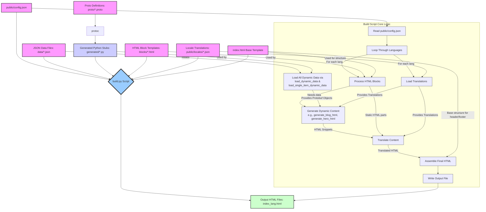

# Data Flow and Protobuf Definitions

This document outlines the structure of our data entities defined using Protocol Buffers and how they are utilized within the `build.py` script to generate dynamic HTML content.

## Protobuf Message Definitions

We use Protocol Buffers to define the schema for our dynamic data entities. Common types like `I18nString` (for internationalized strings), `Image`, `CTA` (Call To Action), and `TitledBlock` are defined in `common.proto`.

### `BlogPost` (`blog_post.proto`)

Represents a single blog post item. Loaded as a list from `data/blog_posts.json`.

```proto
message BlogPost {
  string id = 1;                // Unique identifier
  I18nString title = 2;         // Title of the blog post
  I18nString excerpt = 3;       // Short summary of the post
  CTA cta = 4;                  // Call to action (e.g., "Read More")
}
```

### `PortfolioItem` (`portfolio_item.proto`)

Represents a single portfolio item. Loaded as a list from `data/portfolio_items.json`.

```proto
message PortfolioItem {
  string id = 1;                // Unique identifier
  Image image = 2;              // Image for the portfolio item
  TitledBlock details = 3;      // Title and description for the item
}
```

### `HeroItem` (`hero_item.proto`)

Represents the content for the hero section. Loaded as a single item from `data/hero_item.json`.

```proto
message HeroItem {
  I18nString title = 1;         // Main headline
  I18nString subtitle = 2;      // Supporting text
  CTA cta = 3;                  // Primary call to action
}
```

### `FeatureItem` (`feature_item.proto`)

Represents a feature list item. Loaded as a list from `data/feature_items.json`.

```proto
message FeatureItem {
  TitledBlock content = 1;      // Title and description of the feature
}
```

### `TestimonialItem` (`testimonial_item.proto`)

Represents a single testimonial. Loaded as a list from `data/testimonial_items.json`.

```proto
message TestimonialItem {
  I18nString text = 1;          // The testimonial quote
  I18nString author = 2;        // Author of the testimonial
  Image author_image = 3;       // Image of the author
}
```

## Data Flow in `build.py`

The `build.py` script is responsible for generating the static HTML pages (`index.html`, `index_es.html`, etc.) by assembling HTML blocks and populating them with dynamic data and translations.



### Explanation of Diagram

1. **`public/config.json`**: Configuration file defining which HTML blocks to include, supported languages, and the default language. This is the entry point for the build script's configuration.
2. **JSON Data Files (`data/*.json`)**: These files (e.g., `data/blog_posts.json`, `data/hero_item.json`) contain the raw content for dynamic sections of the website.
3. **Proto Definitions (`proto/*.proto`)**: These files define the structure for various data types like `BlogPost`, `PortfolioItem`, `HeroItem`, etc., using Protocol Buffers.
4. **`protoc` (Protocol Buffer Compiler)**: This tool compiles the `.proto` definitions into Python stub files.
5. **Generated Python Stubs (`generated/*.py`)**: These are the Python classes (e.g., `BlogPost_pb2.py`) generated by `protoc`. They are imported and used by `build.py` to ensure data conforms to the defined schemas.
6. **HTML Block Templates (`blocks/*.html`)**: Individual HTML files for different sections of the page (e.g., `hero.html`, `features.html`). Some contain placeholders for dynamic content.
7. **Locale Translations (`public/locales/*.json`)**: JSON files holding key-value pairs for internationalization (i18n), allowing content to be translated into different languages.
8. **`index.html` (Base Template)**: The main `index.html` file serves as a template for the overall page structure, including the header, footer, and the `<main>` container where blocks are inserted.
9. **`build.py` Script (Core Logic)**:
    * **Read `public/config.json`**: Determines which blocks to use and languages to build for.
    * **Load All Dynamic Data**: Reads all JSON data files from `data/` using:
        * `load_dynamic_data()`: For lists of items (e.g., blog posts, portfolio items).
        * `load_single_item_dynamic_data()`: For single items (e.g., hero content).
        Data is parsed into Protobuf message objects using the generated Python stubs. This data is cached.
    * **Loop Through Languages**: Iterates over each supported language defined in `config.json`.
    * **Load Translations**: For the current language, loads the corresponding `public/locales/{lang}.json` file.
    * **Process HTML Blocks**: For each block specified in `config.json`:
        * Reads the block's HTML template from `blocks/`.
        * **Generate Dynamic Content**: If the block is associated with dynamic data (e.g., `hero.html` uses `data/hero_item.json`), it calls the appropriate generator function (e.g., `generate_hero_html`). These functions take the loaded Protobuf objects and translations to produce HTML snippets.
        * The generated HTML snippet replaces a placeholder in the block's template.
        * **Translate Content**: The combined block content (static parts + dynamically generated snippets) is processed by `translate_html_content` to replace `data-i18n` keys with text from the loaded translations.
    * **Assemble Final HTML**: The translated HTML parts of the header and footer (from the base `index.html` template) and the processed blocks are combined to form the full page content for the current language. The `<html lang="...">` attribute is set.
    * **Write Output File**: The assembled HTML is written to `index_{lang}.html` (or `index.html` for the default language).
10. **Output HTML Files (`index_lang.html`)**: The final, fully assembled, and translated HTML pages for each supported language.

This setup ensures that data handling is strongly typed and structured, improving maintainability and reducing potential errors. The build process is configuration-driven and supports internationalization.
