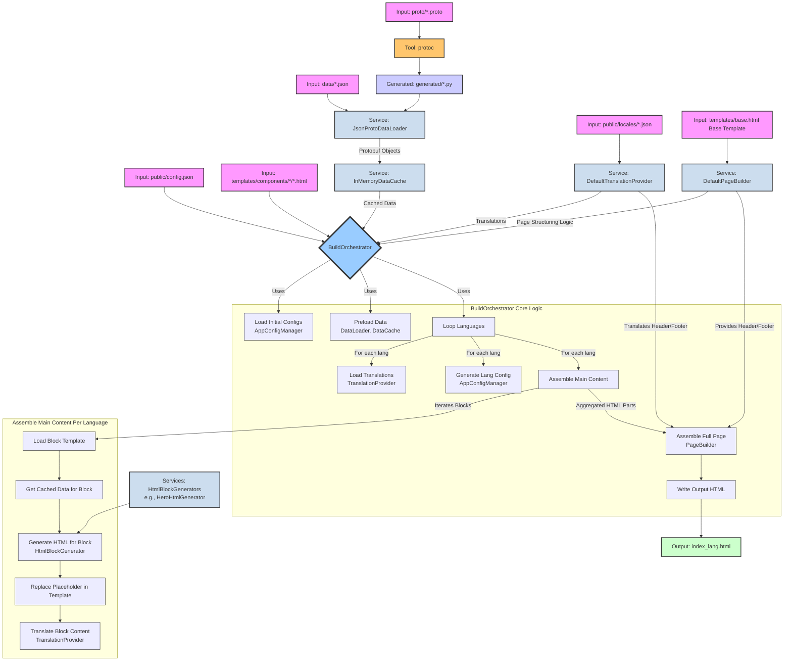

# Data Flow and Protobuf Definitions

This document outlines the structure of our data entities defined using Protocol Buffers and how they are utilized within the `build.py` script to generate dynamic HTML content.

## Protobuf Message Definitions

We use Protocol Buffers to define the schema for our dynamic data entities. Common types like `I18nString` (for internationalized strings), `Image`, `CTA` (Call To Action), and `TitledBlock` are defined in `common.proto`.

### `BlogPost` (`blog_post.proto`)

Represents a single blog post item. Loaded as a list from `data/blog_posts.json`.

```proto
message BlogPost {
  string id = 1;                // Unique identifier
  I18nString title = 2;         // Title of the blog post
  I18nString excerpt = 3;       // Short summary of the post
  CTA cta = 4;                  // Call to action (e.g., "Read More")
}
```

### `PortfolioItem` (`portfolio_item.proto`)

Represents a single portfolio item. Loaded as a list from `data/portfolio_items.json`.

```proto
message PortfolioItem {
  string id = 1;                // Unique identifier
  Image image = 2;              // Image for the portfolio item
  TitledBlock details = 3;      // Title and description for the item
}
```

### `HeroItem` (`hero_item.proto`)

Represents the content for the hero section, supporting multiple variations for A/B testing or content rotation. Loaded as a single `HeroItem` message from `data/hero_item.json`.

```proto
message HeroItemContent {
  I18nString title = 1;         // Main headline for this variation
  I18nString subtitle = 2;      // Supporting text for this variation
  CTA cta = 3;                  // Primary call to action for this variation
  string variation_id = 4;      // Unique identifier for this variation
}

message HeroItem {
  repeated HeroItemContent variations = 1; // A list of content variations for the hero section
  string default_variation_id = 2;         // ID of the variation to use if specific selection logic isn't applied
}
```

*Note: The `build.py` script randomly selects one of the `variations` at build time.*

### `FeatureItem` (`feature_item.proto`)

Represents a feature list item. Loaded as a list from `data/feature_items.json`.

```proto
message FeatureItem {
  TitledBlock content = 1;      // Title and description of the feature
}
```

### `TestimonialItem` (`testimonial_item.proto`)

Represents a single testimonial. Loaded as a list from `data/testimonial_items.json`.

```proto
message TestimonialItem {
  I18nString text = 1;          // The testimonial quote
  I18nString author = 2;        // Author of the testimonial
  Image author_image = 3;       // Image of the author
}
```

### `ContactFormConfig` (`contact_form_config.proto`)

Defines the configuration for the contact form. Loaded as a single item from `data/contact_form_config.json`.

```proto
message ContactFormConfig {
  string form_action_uri = 1;     // The URI where the form data will be submitted
  string success_message_key = 2; // I18n key for the success message
  string error_message_key = 3;   // I18n key for the error message
}
```

### `NavItem` and `Navigation` (`nav_item.proto`)

Define the structure for navigation links. `Navigation` is loaded as a single item from `data/navigation.json`.

```proto
// Message for a single navigation item.
message NavItem {
  I18nString label = 1;       // Using I18nString for the label
  string href = 2;            // URL or anchor link (e.g., "#features")
  string animation_hint = 3;  // Optional: hint for animation type
}

// Message for the overall navigation structure.
message Navigation {
  repeated NavItem items = 1;
}
```

## Data Flow in `build.py`

The `build.py` script is responsible for generating the static HTML pages (`index.html`, `index_es.html`, etc.) by assembling HTML blocks and populating them with dynamic data and translations.



### Explanation of Diagram

The diagram illustrates the data flow and component interactions within the `build.py` script, which uses a `BuildOrchestrator` to manage the page generation process.

1. **Inputs (Pink Nodes)**:
    * **`public/config.json`**: Main configuration file (site settings, languages, blocks to use).
    * **`data/*.json`**: JSON files containing content for dynamic blocks (e.g., hero text, portfolio items).
    * **`proto/*.proto`**: Protocol Buffer definitions that define the schema for the data in `data/*.json`.
    * **`templates/components/*/*.html`**: HTML template files for individual content components.
    * **`public/locales/*.json`**: JSON files with translations for different languages.
    * **`templates/base.html` (Base Template)**: The main HTML file providing the overall page structure.

2. **Initial Processing & Tools**:
    * **`protoc` (Orange Node)**: The Protocol Buffer compiler. It processes `.proto` files.
    * **`generated/*.py` (Light Blue Node)**: Python stub files generated by `protoc`. These classes represent the data structures.

3. **Core Services (Light Cyan Nodes)**:
    * **`JsonProtoDataLoader`**: Reads JSON data from `data/*.json`, validates it against the Protobuf stubs (`generated/*.py`), and converts it into Python Protobuf objects.
    * **`InMemoryDataCache`**: Stores the loaded Protobuf objects in memory to avoid redundant loading.
    * **`DefaultTranslationProvider`**: Loads translations from `public/locales/*.json` and provides functions to translate text and HTML content.
    * **`DefaultPageBuilder`**: Manages the overall HTML page structure. It uses the base `templates/base.html` and assembles the final page with processed component HTML.
    * **`HtmlBlockGenerators` (e.g., `HeroHtmlGenerator`, `PortfolioHtmlGenerator`)**: A collection of classes, each responsible for generating the specific HTML for a type of content component (e.g., rendering portfolio items into HTML using templates from `templates/components/`).

4. **`BuildOrchestrator` (Dark Blue Node)**: The central component in `build.py`.
    * It initializes and coordinates all services.
    * **Core Logic (Grey Subgraph)**:
        * **Load Initial Configs**: Uses `DefaultAppConfigManager` to load `public/config.json` and navigation data.
        * **Preload Data**: Instructs the `JsonProtoDataLoader` to load all necessary dynamic data, which is then stored in `InMemoryDataCache`.
        * **Loop Languages**: Iterates through each supported language defined in `config.json`.
        * **Load Translations**: For the current language, uses `DefaultTranslationProvider` to load the relevant locale file.
        * **Generate Lang Config**: Uses `DefaultAppConfigManager` to create a language-specific version of the configuration (e.g., `public/generated_configs/config_en.json`).
        * **Assemble Main Content**: For the current language, orchestrates the generation of HTML for all content blocks. (See "Assemble Main Content Per Language" subgraph).
        * **Assemble Full Page**: Uses `DefaultPageBuilder` to combine the translated header, footer, and the assembled main content into a complete HTML page.
        * **Write Output HTML**: Saves the generated page to a file (e.g., `index_en.html`).

5. **Assemble Main Content Per Language (Light Grey Subgraph)**: This process is executed by `BuildOrchestrator` for each component specified in `config.json`.
    * **Load Component Template**: `HtmlBlockGenerator` loads its specific template from `templates/components/<component_name>/<component_name>.html`.
    * **Get Cached Data**: Retrieves the relevant Protobuf data for this component from `InMemoryDataCache`.
    * **Generate HTML for Component**: Passes the data and translations to the appropriate `HtmlBlockGenerator` to produce the HTML for that specific component.
    * **Translate Component Content**: Jinja templates within components use the `translations` object to directly include translated strings. Further `data-i18n` tags for client-side translation might also be present.

6. **Output (Green Node)**:
    * **`index_lang.html`**: The final, fully assembled, and translated HTML pages for each supported language (e.g., `index.html`, `index_es.html`).

This modular, service-oriented architecture allows for clear separation of concerns: data loading, translation, HTML generation for specific blocks, and overall page assembly are handled by distinct components, orchestrated by `BuildOrchestrator`.
This setup ensures that data handling is strongly typed and structured, improving maintainability and reducing potential errors. The build process is configuration-driven and supports internationalization.
