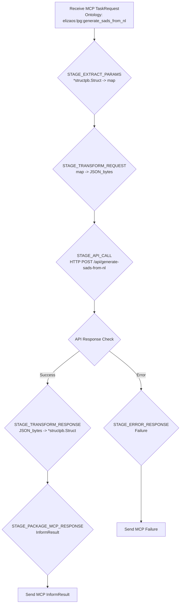

# Visualizing MCP Task Flows

This document explores ideas for visualizing task flows, particularly those executed by an AI agent like Jules within the MCP (Message Control Protocol) service. The goal is to make the agent's internal planning and execution steps more transparent and understandable.

## Motivation

Understanding how an AI agent processes a request, breaks it down into steps, interacts with other services, and handles data transformations can be complex. Textual descriptions or logs are useful but can be hard to follow for intricate flows. Visualizations can provide a clearer, more intuitive overview.

## Using Mermaid.js for Diagramming

Mermaid.js is a JavaScript-based diagramming and charting tool that uses Markdown-inspired text definitions to create and modify diagrams dynamically.

### Sequence Diagram Example

This shows the interaction flow for an MCP task that involves an internal API call:

```mermaid
sequenceDiagram
    participant Client as MCP Client
    participant MCPSvc as MCP Service (Go)
    participant InternalAPI as Internal API (/api/generate-sads-from-nl)

    Client->>+MCPSvc: Send MCP TaskRequest (Ontology: elizaos:lpg:generate_sads_from_nl, Params: *structpb.Struct)
    MCPSvc->>MCPSvc: [STAGE_EXTRACT_PARAMS]
    MCPSvc->>MCPSvc: [STAGE_TRANSFORM_REQUEST_TO_JSON]
    MCPSvc->>+InternalAPI: HTTP POST (JSON Request Body)
    InternalAPI-->>-MCPSvc: HTTP Response (JSON Response Body / Error)
    alt Successful API Call
        MCPSvc->>MCPSvc: [STAGE_TRANSFORM_RESPONSE_TO_STRUCTPB]
        MCPSvc->>MCPSvc: [STAGE_PACKAGE_MCP_INFORM_RESULT]
        MCPSvc-->>-Client: Send MCP InformResult (ResultDetails: *structpb.Struct)
    else API Call Error
        MCPSvc->>MCPSvc: [STAGE_PACKAGE_MCP_FAILURE]
        MCPSvc-->>-Client: Send MCP Failure (ErrorDetails)
    end
```

### Flowchart Example

This focuses more on the processing stages within the MCP service:



## Defining a Task Flow Ontology

To systematically generate visualizations or allow machine interpretation of task flows, a defined ontology is beneficial. This could be a SADS (Structured Architectural Description Schema) component or a new ontology (e.g., under `common/genesis/ontologyofways`).

Core elements of such an ontology might include:

*   **`TaskFlowDefinition`**: The overall container for a task flow.
*   **`Trigger`**: What initiates the flow.
*   **`DataElement`**: Formal declaration of a piece of data.
*   **`Stage`**: A single step or unit of work. This is an abstract base.
    *   Subtypes include `Transformation`, `ActionCall`, `DecisionPoint`, etc.
*   **`Input` / `Output` (for Stages)**: Specifies data elements consumed or produced.
*   **`ErrorHandlingRule`**: Defines how to react to an error within a stage.

See below for a more detailed breakdown.

Serialization Format: YAML or JSON are good candidates.

### Detailed Ontology Elements

**1. `TaskFlowDefinition`**
   *   Purpose: The root element representing a single, complete task flow.
   *   Attributes:
        *   `id`: (String, Mandatory) A unique identifier for this task flow definition (e.g., `mcp-generate-sads-from-nl-flow`).
        *   `version`: (String, Mandatory) Version of this flow definition (e.g., `1.0.0`).
        *   `name`: (String, Mandatory) A human-readable name for the task flow (e.g., "MCP Task: Generate SADS from Natural Language").
        *   `description`: (String, Optional) A more detailed description of what the task flow does.
        *   `author`: (String, Optional) Who defined this flow.
        *   `creation_timestamp`: (DateTime, Optional) When this flow definition was created.
        *   `trigger`: (`Trigger`, Mandatory) Defines what initiates this flow. (See element 2)
        *   `data_elements`: (List of `DataElement`, Optional) A central declaration of all data items used or produced in this flow. (See element 3)
        *   `stages`: (List of `Stage`, Mandatory) The sequence of operations that make up the flow. (See element 4)
        *   `error_handling_defaults`: (Map, Optional) Default error handling strategies.

**2. `Trigger`**
   *   Purpose: Describes the event or condition that initiates the task flow.
   *   Attributes:
        *   `id`: (String, Mandatory) Unique ID for the trigger definition.
        *   `type`: (String, Mandatory, Enum) E.g., `MCPMessage`, `HttpWebhook`, `ScheduledTimer`.
        *   `description`: (String, Optional).
        *   `filter_criteria`: (Map, Conditional) Criteria the trigger event must meet (e.g., `ontology_pattern` for `MCPMessage`).
        *   `outputs`: (List of `TriggerOutputMapping`, Optional) How data from the trigger event maps to `DataElement`s.
            *   `TriggerOutputMapping`: `source_path` (String), `data_element_id` (String).

**3. `DataElement`**
   *   Purpose: A formal declaration of a piece of data used or produced within the flow.
   *   Attributes:
        *   `id`: (String, Mandatory) Unique ID for this data element.
        *   `name`: (String, Optional) Human-readable name.
        *   `description`: (String, Optional).
        *   `data_type`: (String, Mandatory) E.g., `string`, `json_object`, `google.protobuf.Struct`.
        *   `schema_definition`: (String or Map, Optional) Detailed schema (e.g., JSON schema string).
        *   `is_sensitive`: (Boolean, Optional, Default: `false`).

**4. `Stage`**
   *   Purpose: An abstract base for a single step or unit of work.
   *   Attributes:
        *   `id`: (String, Mandatory) Unique identifier for this stage.
        *   `name`: (String, Mandatory) Human-readable name.
        *   `description`: (String, Optional).
        *   `stage_type`: (String, Mandatory, Enum) E.g., `Transformation`, `ActionCall`, `DecisionPoint`.
        *   `dependencies`: (List of String, Optional) List of `Stage.id`s that must complete first.
        *   `inputs`: (List of `StageInputMapping`, Optional) Data consumed.
            *   `StageInputMapping`: `data_element_id` (String), `as_name` (String, optional alias), `is_required` (Boolean).
        *   `outputs`: (List of `StageOutputMapping`, Optional) Data produced.
            *   `StageOutputMapping`: `data_element_id` (String), `produced_as` (String, optional name).
        *   `on_error`: (List of `ErrorHandlingRule`, Optional) Stage-specific error handling.
        *   `timeout_seconds`: (Integer, Optional).

**4.1. `Stage` subtype: `Transformation`**
   *   Inherits from: `Stage` (`stage_type` = `Transformation`)
   *   Purpose: Transforms data.
   *   Additional Attributes:
        *   `transform_engine`: (String, Optional, Enum) E.g., `jsonata`, `jq`, `custom_code_snippet`.
        *   `transform_logic`: (String or Map, Mandatory) Transformation rules or code.

**4.2. `Stage` subtype: `ActionCall`**
   *   Inherits from: `Stage` (`stage_type` = `ActionCall`)
   *   Purpose: Executes an action.
   *   Additional Attributes:
        *   `action_type`: (String, Mandatory, Enum) E.g., `HttpApiCall`, `InternalFunctionCall`, `McpMessageSend`.
        *   `action_details`: (Map, Mandatory) Parameters specific to `action_type` (e.g., URL for `HttpApiCall`).

**4.3. `Stage` subtype: `DecisionPoint`**
   *   Inherits from: `Stage` (`stage_type` = `DecisionPoint`)
   *   Purpose: Routes flow based on conditions.
   *   Additional Attributes:
        *   `decision_logic_engine`: (String, Optional, Enum) E.g., `cel_expression`, `json_logic`.
        *   `branches`: (List of `DecisionBranch`, Mandatory)
            *   `DecisionBranch`: `condition` (String/Map), `next_stage_id` (String).
        *   `default_branch_next_stage_id`: (String, Optional).

**5. `ErrorHandlingRule`**
   *   Purpose: Defines how to react to an error.
   *   Attributes:
        *   `error_pattern`: (String, Mandatory) Glob/regex for error codes/messages.
        *   `action`: (String, Mandatory, Enum) E.g., `Retry`, `FailFlow`, `ProceedToStage`.
        *   `action_params`: (Map, Conditional) Parameters for the action (e.g., `max_attempts` for `Retry`).
        *   `output_error_data_element_id`: (String, Optional) If error details are captured.

### Example Stage Snippet (YAML - Illustrative)

```yaml
# This is a conceptual snippet based on the detailed ontology.
# A full example would be part of the next plan step.

# - id: STAGE_EXTRACT_PARAMS # Belongs to a Stage definition
#   name: "Extract MCP Parameters"
#   stage_type: Transformation
#   description: "Converts *structpb.Struct from MCP message to internal map."
#   inputs:
#     - data_element_id: mcp_task_parameters_struct # Assumes this DataElement is defined
#       as_name: raw_parameters
#   outputs:
#     - data_element_id: internal_api_request_map # Assumes this DataElement is defined
#       produced_as: prepared_data
#   transform_engine: custom_code_snippet
#   transform_logic:
#     language: go_snippet
#     code: |
#       // Go code to convert raw_parameters (structpb.Struct)
#       // to prepared_data (map[string]interface{})
#       // This would be executed by an interpreter or plugin system.
```

## Generating HTML from the Ontology

Once a task flow is defined using this ontology (e.g., in a YAML file), a program (Go script, etc.) could:
1.  Parse the ontology definition.
2.  Generate HTML to represent the flow.

This approach allows the AI agent's logic to be represented in a structured, machine-readable format, which can then be compiled into a human-readable (and potentially interactive) HTML visualization. This enhances transparency and debuggability.

### Basic HTML Structure Design

The goal is to translate the YAML definition into a clear, hierarchical, and eventually interactive HTML representation.

**1. `TaskFlowDefinition` (Overall Container)**
   - A `div.task-flow` containing:
     - `header.flow-header`: For name, version, description.
     - `section.flow-trigger`: Details of the trigger.
     - `section.flow-data-elements`: List of `data-element` items.
     - `main.flow-stages`: Container for all stage visualizations.
     - `footer.flow-footer`: Additional global info.

**2. `Stage` (Individual Stage Container)**
   - An `article.stage.stage-type-{stage_type}` for each stage.
   - Contains:
     - `div.stage-header`: Name, ID, type badge.
     - `p.stage-description`.
     - `div.stage-dependencies`: List of links to dependency stages.
     - `div.stage-io`: Sections for `stage-inputs` and `stage-outputs`, listing data elements.
     - `div.stage-specific-details`: Content varies by `stage_type` (Transformation, ActionCall, DecisionPoint).
       - Example for `Transformation`: Shows engine, logic/code.
       - Example for `ActionCall`: Shows action type, method, URL, etc.
       - Example for `DecisionPoint`: Shows branches, conditions, next stages.
     - `div.stage-error-handling`: Lists error handling rules.
     - `div.stage-timeout`: Shows timeout if defined.

**3. Styling and Connections (CSS/JS)**
   - **CSS:** Generous use of classes for styling boxes, typography, badges. Different stage types can have distinct visual cues (e.g., border colors).
   - **Connections:**
     - Initially, dependencies can be represented by hyperlinks between stages.
     - For visual flow lines (arrows), JavaScript would likely be required to calculate positions and render SVG lines or integrate with a graph visualization library (like Mermaid.js, jsPlumb, or Cytoscape.js). Pure CSS for complex graph connections is very limited.
   - **Interactivity (JS):** Could be added later for features like expanding/collapsing stage details, tooltips on hover, or animating the flow.

This structure aims for semantic HTML where possible, providing a good foundation for styling and future JavaScript-based enhancements for interactivity and dynamic graph drawing.

## Implementation of Ontology Parser and HTML Generator (Go)

A Go program can be developed to parse the YAML task flow definitions and generate the corresponding HTML visualizations.

**1. Ontology Parser (YAML to Go Structs)**
   *   **Define Go Structs:** Create Go struct types (e.g., `TaskFlowDefinition`, `Stage`, `DataElement`) that mirror the YAML ontology. Use `yaml:"fieldName"` struct tags for unmarshalling.
       *   Handling `Stage` subtypes (Transformation, ActionCall, etc.) can be done by including all possible subtype fields in the generic `Stage` struct or by using `interface{}` and custom unmarshalling logic for more type safety.
   *   **Read and Unmarshal YAML:** Use a library like `gopkg.in/yaml.v3` to read the `.flow.yaml` file and unmarshal its content into the defined Go structs.

**2. HTML Generator (Go Structs to HTML)**
   *   **`html/template` Package:** Utilize Go's standard library package for safe HTML generation.
   *   **Create HTML Templates:** Develop `.tmpl` files (e.g., `task_flow.tmpl`, `stage.tmpl`) that correspond to the designed HTML structure. These templates will use actions like `{{.FieldName}}` and `{{range .Items}}` to insert data from the Go structs.
       *   Partials or nested templates can be used for different components (e.g., a template for stage inputs/outputs, a template for transformation details).
   *   **Template Helper Functions:** Define custom functions (via `template.FuncMap`) for any complex formatting or logic needed within the templates.
   *   **Parse and Execute Templates:** The Go program will parse the template files and then execute the main template with the populated `TaskFlowDefinition` struct as data, writing the output to an HTML file.

**3. CSS and JavaScript**
   *   **CSS:** A separate CSS file (e.g., `styles.css`) will be linked in the generated HTML to provide styling for all defined classes.
   *   **JavaScript (for enhancements):**
       *   Basic interactivity (e.g., expand/collapse) can be added with simple JavaScript.
       *   For dynamic graph connections (drawing arrows between stages), more complex JavaScript would be needed to:
           1.  Calculate the positions of HTML elements representing stages.
           2.  Dynamically generate and append SVG elements for lines/arrows.
           3.  Alternatively, integrate a client-side JavaScript graph visualization library (e.g., Mermaid.js by generating its markdown, jsPlumb, Cytoscape.js). The Go program could prepare the data in the format required by such a library.

**Workflow Example:**
   1. A user runs the Go CLI tool: `taskflow-visualizer --flowfile path/to/flow.yaml --output out.html`.
   2. The tool parses `flow.yaml` into Go structs.
   3. It then uses these structs and pre-defined HTML templates to generate `out.html`.
   4. The user opens `out.html` in a browser, which also loads associated CSS and JS files.
